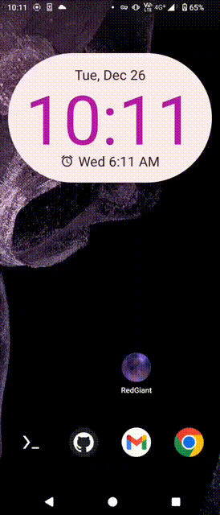

# 光年一瞬: A Story of the Death and Rebirth of Red Giants

## Prerequirement

- Unity 2022.3.13f1
- AR Foundation 5.1.1

## How to use

- Clone project
    ```
    git clone https://github.com/Eleven1Liu/DIP-2023-Final.git
    ```
- Add Project to Unity
- Open ˋAssets/Scenes/Mainˋ and click ˋFile/Build Settingsˋ to build project


- Take Android application for example, we can build `RedGiant.apk` on target device (i.e., Sony ***) via Build And Run.


- After all things done, click on the planet icon. You will see the binary star system in the sky!


## Team members
- Engineer: @kerry30338 @Wu-Cheng-Yu @Eleven1Liu @User154742504910672534362390528
- Designer: 鄭莉蓉
